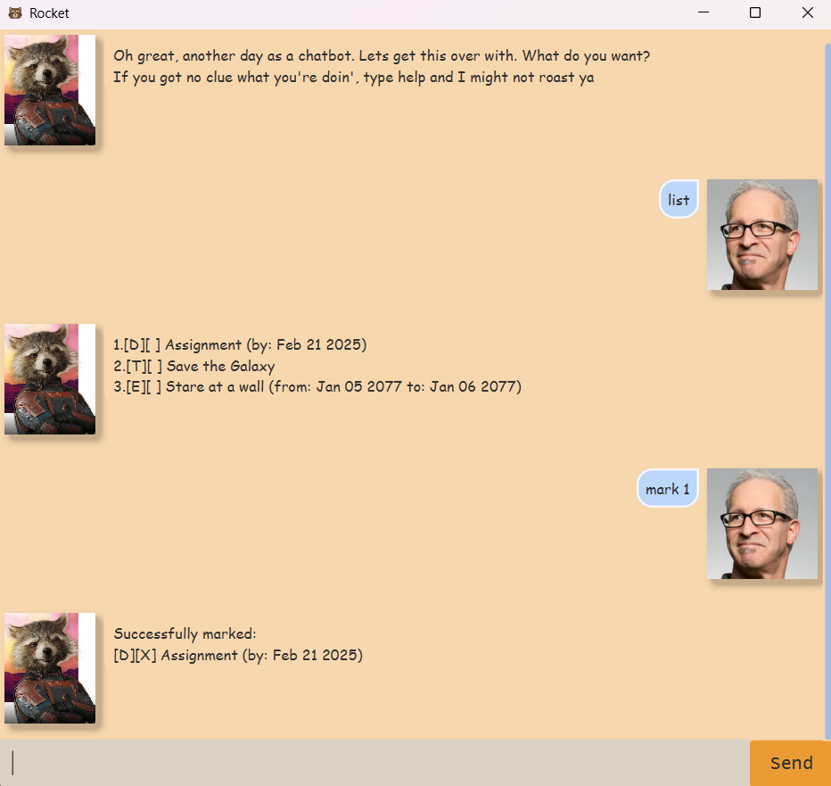

# Rocket User Guide
*Rocket Raccoon* from *Guardians of the Galaxy* is here to be your personal chatbot.   
This is a **Command Line Interface(CLI) based chatbot** that can help you track tasks.  
Careful not to make mistakes lest you enjoy getting roasted.

- [Setup](#setup)
- [Features](#features)
  * [Add Todo](#adding-todo-todo)
  * [Add Deadline](#adding-deadline-deadline)
  * [Add Event](#adding-event-event)
  * [View List](#viewing-your-list-list)
  * [Mark a Task](#marking-a-task-mark)
  * [Unmark a Task](#unmarking-a-task-unmark)
  * [Find Tasks](#finding-tasks-by-name-find)
  * [Edit a Task](#edit-a-task-edit)
  * [Exit Application](#exiting-the-application-bye)
- [Credits](#credits)

## Setup
1. Ensure you have Java 17 or above installed in your Computer.
2. Download the latest jar file from [here](https://github.com/KimHan01/ip/releases).
3. Put the jar file into a folder that you wish to run the file from.
4. Open a command terminal, `cd` into the folder you put the jar file in,
   and use the `java -jar rocket.jar` command to run the application.  
   A GUI similar to the one below should appear in a few seconds.  
   

## Features
> [!NOTE]
> * There must be a space after any command keyword (E.g. `todo example`)  
> * `Date` format: YYYY-MM-DD (e.g. 2025-06-07)  
> * `Index` is an integer value representing the task number in the list  
> * Field specifier: `/n` for name, `/by` for deadline date, `/from` or `/to` for event dates
> * You can only edit one field at a time
> * Command keywords are case-insensitive (E.g. `ToDo`, `TODO` are the same)

## Viewing help: `help`

Shows a message containing commands and how to use them  
Format: `help`

## Adding todo: `todo`

Adds a todo task  

Format: `todo [task name]`

Example: `todo Save the Galaxy`  
Expected Response:
```
Successfully added:
[T][ ] Save the Galaxy
Now you have 1 tasks in the list
```

## Adding deadline: `deadline`

Adds a deadline task with a deadline date to complete by  

Format: `deadline [task name] /by [date]`

Example: `deadline Assignment /by 2025-02-21`  
Expected Response:  
```
Successfully added:
[D][ ] Assignment (by: Feb 21 2025)
Now you have 2 tasks in the list
```

## Adding event: `event`

Adds an event task with a start and end date  

Format: `event [task name] /from [date] /to [date]`

Example: `event Meet Groot /from 2077-01-05 /to 2077-01-06`  
Expected Response:
```
Successfully added:
[E][ ] Meet Groot (from: Jan 05 2077 to: Jan 06 2077)
Now you have 3 tasks in the list
```

## Viewing your list: `list`

Shows you the list of tasks you currently have

Format: `list`

## Marking a task: `mark`

Marks a task as done  
Format: `mark [index]`

Example: `mark 1`  
Expected Response:
```
1.[D][X] Assignment (by: Feb 21 2025)
2.[T][ ] Save the Galaxy
3.[E][ ] Meet Groot (from: Jan 05 2077 to: Jan 06 2077)
```

## Unmarking a task: `unmark`

Unmarks a task  

Format: `unmark [index]`

Example: `unmark 1`  
Expected Response:
```
1.[D][ ] Assignment (by: Feb 21 2025)
2.[T][ ] Save the Galaxy
3.[E][ ] Meet Groot (from: Jan 05 2077 to: Jan 06 2077)
```

## Finding tasks by name: `find`

Shows you a list of tasks with names that contain the keyword given  

Format: `find [keyword]`

Example: `find G`  
Expected Response:
```
Here are the matching tasks in your list:
1.[T][ ] Save the Galaxy
2.[E][ ] Meet Groot (from: Jan 05 2077 to: Jan 06 2077)
```

## Edit a task: `edit`

Edits a field of a task  

Format: `edit [index] [field specifier] [new value for field]`

Example: `edit 1 /by 2025-02-24`  
Expected Response:
```
I have edited this task:
[D][ ] Assignment (by: Feb 21 2025)
To:
[D][ ] Assignment (by: Feb 24 2025)
```

## Exiting the application: `bye`

Exits the application

## Credits

The design for this user guide is inspired heavily by [AB-3's user guide](https://se-education.org/addressbook-level3/UserGuide.html)

Most of rocket's responses are created with the help of ChatGPT to more accurately capture his personality.

GitHub Copilot was used to generate some of the java docs more quickly

### Source of Media Assets:  
- Rocket's chatbot image:  
https://marvelcinematicuniverse.fandom.com/wiki/Rocket_Raccoon?file=Rocket_Vol._3.jpg
- Rocket application icon:   
https://www.veryicon.com/icons/avatar/superhero-marvel/galaxy-guard-raccoon-rocket.html